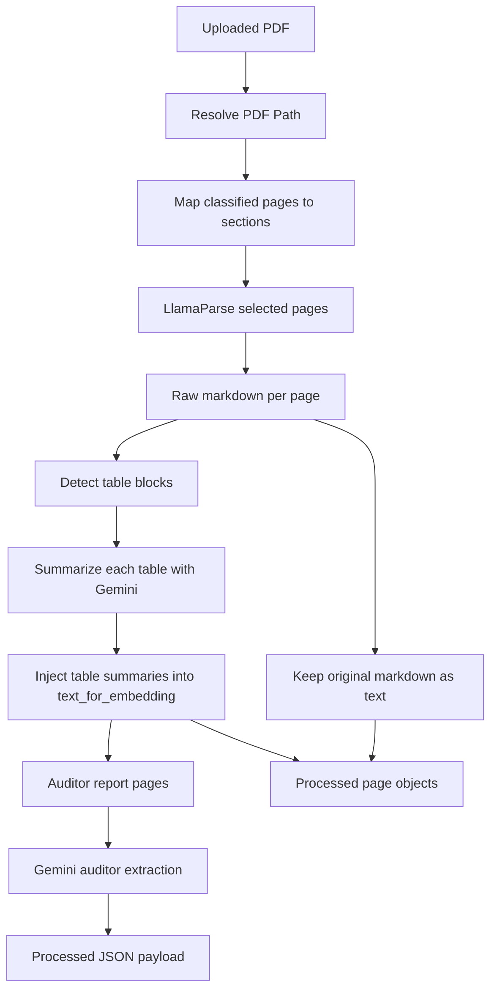
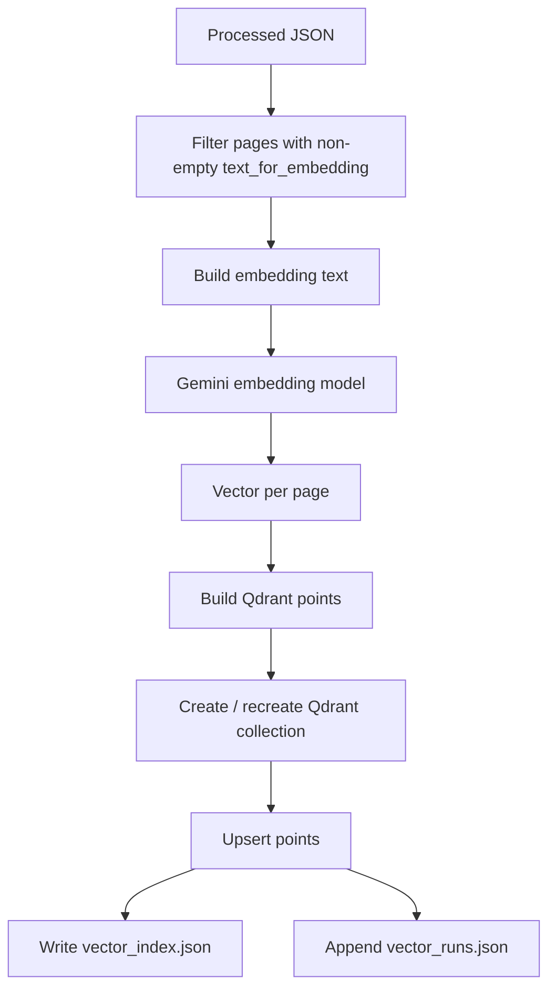
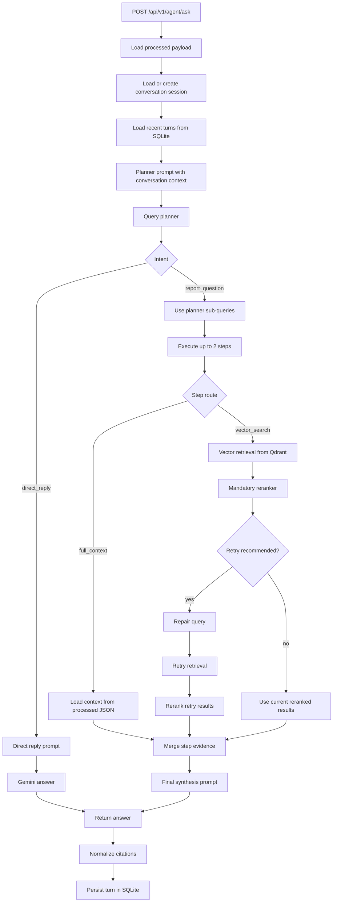

# FinScout Architecture

This document explains the architecture of FinScout from document ingestion through retrieval and answer generation.

It is split into two parts:

1. document preparation and vector ingestion
2. runtime question answering

## 1. System overview

At a high level, FinScout has two phases:

- **offline / preparation phase**
  - parse the PDF
  - clean and structure the content
  - summarize tables
  - extract auditor metadata
  - create a processed JSON artifact
  - embed pages and store them in Qdrant

- **online / question-answering phase**
  - receive user question
  - plan the retrieval strategy
  - load full context or retrieve from vector DB
  - rerank results
  - optionally repair and retry retrieval
  - synthesize a grounded answer with citations

## 2. End-to-end architecture

```mermaid
flowchart TD
    A[Annual Report PDF] --> B[Document Ingestion Pipeline]
    B --> C[Processed JSON]
    C --> D[Vector Ingestion]
    D --> E[Qdrant Collection]

    U[User Question] --> F[/api/v1/agent/ask]
    F --> G[Conversation Memory]
    F --> H[Query Planner]
    H --> I{Intent}
    I -->|direct_reply| J[Direct Reply Prompt]
    I -->|report_question| K[Execute Planned Steps]

    K --> L{Per-step route}
    L -->|full_context| M[Load Full Context from Processed JSON]
    L -->|vector_search| N[Qdrant Retrieval]
    N --> O[Reranker]
    O --> P{Weak Retrieval?}
    P -->|yes| Q[Retrieval Repair]
    Q --> R[Retry Retrieval]
    R --> S[Rerank Retry Results]
    P -->|no| T[Use Initial Ranked Results]
    S --> U2[Use Retry Results]

    M --> V[Final Synthesis Prompt]
    T --> V
    U2 --> V
    J --> W[Gemini Answer]
    V --> W
    W --> X[Answer + Citations]
```

## 3. Document preparation pipeline

The ingestion pipeline starts with a PDF and ends with a processed JSON file in pipeline storage.

Main service:
- [document_ingestion_service.py](backend/app/services/document_processing/document_ingestion_service.py)

Supporting helpers:
- [ingestion_pipeline.py](backend/app/services/document_processing/ingestion_pipeline.py)
- [table_processing.py](backend/app/services/document_processing/table_processing.py)
- [auditor_extraction.py](backend/app/services/document_processing/auditor_extraction.py)

### 3.1 PDF ingestion flow



### 3.2 What gets stored per page

Each processed page stores both:

- `text`
  - the original parsed markdown-like content from LlamaParse
  - used for display, citations, and full-context answering

- `text_for_embedding`
  - a cleaned version of the page
  - image markdown, links, and formatting noise removed
  - table summaries injected as plain-language text
  - used for embedding and retrieval

Additional page metadata includes:
- `page_number`
- `section`
- `has_table`
- `tables`

### 3.3 Why there are two text representations

FinScout separates **retrieval text** from **display text** on purpose.

#### `text`
Used when:
- building user-facing citation excerpts
- providing full-context answer input
- preserving page fidelity

#### `text_for_embedding`
Used when:
- embedding into vector space
- giving the reranker semantically cleaner content
- representing table-heavy pages in a retrieval-friendly way

This helps avoid embedding raw markdown noise while still preserving the original page for user-facing output.

## 4. Table parsing and summarization

Table-heavy annual reports are hard to retrieve well if raw HTML or markdown tables are embedded directly.

FinScout handles this by:

1. detecting table blocks
2. replacing them with placeholders in cleaned text
3. asking Gemini to summarize each table in dense factual prose
4. injecting those summaries back into `text_for_embedding`

Relevant code:
- [table_processing.py](backend/app/services/document_processing/table_processing.py)

This is important because many financial facts live in:
- income statements
- balance sheets
- cash flow statements
- five-year summary tables

Without this step, vector retrieval and reranking would be much weaker on financial line-item questions.

## 5. Auditor extraction

FinScout also performs a dedicated metadata extraction pass on pages classified as `auditor_report`.

It consolidates those pages and sends them to Gemini to extract:
- `company_name`
- `auditor_opinion`
- `auditor_firm`
- `auditor_name`
- `audit_period`

Relevant code:
- [auditor_extraction.py](backend/app/services/document_processing/auditor_extraction.py)

This metadata is written into the processed payload and becomes useful later for:
- query planning
- answer prompts
- demo report metadata

## 6. Processed JSON artifact

The main pipeline artifact is:

```text
backend/storage/pipelines/<report>/processed_<report>.json
```

This file becomes the source of truth for:
- report metadata
- classified sections
- full-context loading
- vector ingestion input

It contains:
- report-level metadata
- classified page groups
- per-page `text`
- per-page `text_for_embedding`
- table summaries

## 7. Vector ingestion architecture

Once the processed JSON exists, FinScout creates a Qdrant collection from it.

Main service:
- [vector_ingestion_service.py](backend/app/services/vector_ingestion/vector_ingestion_service.py)

Supporting metadata:
- [vector_index.py](backend/app/services/vector_ingestion/vector_index.py)

### 7.1 Vector ingestion flow



### 7.2 What gets embedded

Each page is embedded using a combined string shaped like:

```text
title: <company> annual report <year> <section> | text: <text_for_embedding>
```

This means the embedding includes:
- company context
- year context
- section context
- cleaned textual page content

### 7.3 What gets stored in Qdrant

Each Qdrant point stores:
- `page_number`
- `section`
- `has_table`
- `text`
- `text_for_embedding`
- `tables`
- report metadata like `pdf_name`, `company_name`, `year`

That payload becomes useful at runtime for:
- reranking
- answer context building
- citation extraction

## 8. Query planning architecture

When the user asks a question, the first important decision point is the planner.

Main service:
- [query_planner_service.py](backend/app/services/query_planning/query_planner_service.py)

The planner uses Gemini to decide:
- whether the question is `direct_reply` or `report_question`
- whether the question is single-step or multi-step
- which sections are relevant
- which route each step should use

### 8.1 Planner output shape

At the top level, the planner returns:
- `intent`
- `is_multi_step`
- `sub_queries`

Each sub-query carries:
- `query`
- `selected_sections`
- `route_strategy`
- `vector_search_sections`
- `full_context_sections`
- `goal`

### 8.2 Route inference

The planner model does not directly guess every implementation detail. Backend logic infers route behavior from selected sections:

- exactly one short financial/auditor section
  - `full_context`
- multiple sections or broad query
  - `vector_search`
- conversational turn
  - `direct_reply`

## 9. Full-context loading

Some sections are short and structured enough that FinScout loads the whole section directly instead of retrieving page chunks.

Main service:
- [query_context_service.py](backend/app/services/query_planning/query_context_service.py)

Eligible sections:
- `auditor_report`
- `balance_sheet`
- `income_statement`
- `equitychange_statement`
- `cashflow_statement`

In this path:
- the relevant pages are pulled from processed JSON
- their raw `text` is concatenated
- the answer model sees the whole section

This avoids unnecessary vector retrieval for highly structured statement pages.

## 10. Runtime `agent/ask` architecture

Main route:
- [agent.py](backend/app/api/routes/agent.py)

Main orchestrator:
- [agent_service.py](backend/app/services/agent/agent_service.py)

Supporting services:
- [conversation_memory_service.py](backend/app/services/agent/conversation_memory_service.py)
- [reranker_service.py](backend/app/services/agent/reranker_service.py)
- [retrieval_repair_service.py](backend/app/services/agent/retrieval_repair_service.py)
- [vector_query_service.py](backend/app/services/vector_ingestion/vector_query_service.py)

### 10.1 `agent/ask` runtime flow



### 10.2 Conversation memory

Conversation memory is stored in SQLite and used to help the planner and answer prompts understand follow-ups such as:
- "what about last year?"
- "compare that to cash flow"
- "who was the auditor again?"

Memory is used to improve continuity, not to bypass retrieval.

FinScout still retrieves fresh evidence for new report questions.

## 11. Vector retrieval, reranking, and repair

For `vector_search` steps:

1. Qdrant retrieves top candidates
2. Gemini reranker selects the best pages
3. if the retrieval looks weak, a repair prompt rewrites the query once
4. retrieval runs again
5. reranker runs again

This gives FinScout a small self-correction loop without full agent recursion.

### 11.1 Why reranking is mandatory

Raw vector similarity is useful but not always enough for annual reports because:
- multiple nearby pages can be semantically similar
- narrative pages and financial tables can both mention the same concepts
- the best evidence page is not always the highest cosine match

The reranker improves:
- evidence selection
- citation quality
- retrieval quality judgment

## 12. Final answer generation

After evidence is collected across one or more executed steps:

- FinScout builds a final answer prompt
- includes company and year metadata
- includes conversation context
- includes grouped step evidence
- asks Gemini for a grounded answer with citations

The answer model is instructed to:
- answer only from supplied context
- avoid prior knowledge
- avoid speculation
- cite supporting pages

## 13. Citation generation

The answer model returns structured citations by page number and section.

The backend then enriches those citations with:
- `page_number`
- `section`
- cleaned `excerpt`

Citation excerpts come from the original page `text`, not the embedding text, so they are more faithful for user display.

## 14. Frontend architecture

The current frontend is a split-pane Next.js app:

- left pane: PDF viewer
- right pane: chat interface

It uses:
- `/api/v1/agent/ask` for answers
- `/api/v1/documents/report`
- `/api/v1/documents/report/pdf`

The frontend supports:
- chat history
- citations
- executed step inspection
- PDF navigation
- debug panel

## 15. Why this architecture works well for annual reports

Annual reports are awkward documents because they mix:
- narrative sections
- dense financial statements
- tables
- audit text
- corporate structure and governance pages

FinScout’s architecture handles that by splitting responsibilities:

- preparation pipeline handles messy PDF structure
- `text_for_embedding` handles retrieval quality
- `text` preserves user-facing fidelity
- planner chooses the right retrieval mode
- full-context is used where whole-section reading is better
- vector retrieval is used where semantic search helps
- reranking and repair reduce retrieval drift
- evaluation harness gives a way to measure answer quality

That combination is what makes the system more robust than a plain "embed everything and search top-k" pipeline.
